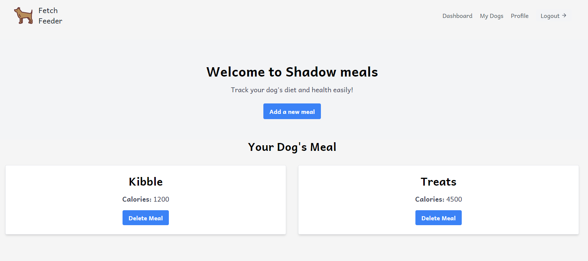

# Fetch Feeder

## Descirption

Fetch Feeder is an innovative app designed to help dog owners effortlessly track their dog's diet and health. With features to log meals, monitor calorie intake, and track weight, Fetch Feeder ensures your furry friend stays happy and healthy. Personalised profiles keep you proactive in managing your dog's health, making pet care easier and more effective.

## User Story
AS A dog owner\
I WANT to track my dog's diet, including meals, calories, and weight\
SO THAT I can ensure their health and well-being with ease

## Project Requirements

Use Node.js and Express.js to create a RESTful API.\
Use Handlebars.js as the template engine.\
Use PostgreSQL and the Sequelize ORM for the database.\
Have both GET and POST routes for retrieving and adding new data.\
Use at least one new library, package, or technology that we haven’t discussed.\
Have a folder structure that meets the MVC paradigm.\
Include authentication (express-session and cookies).\
Protect API keys and sensitive information with environment variables.\
Be deployed using Render (with data).\
Have a polished UI.\
Be responsive.\
Be interactive (in other words, accept and respond to user input).\
Meet good-quality coding standards (file structure, naming conventions, follows best practices for class/id naming conventions, indentation, quality comments, and so on).\
Have a professional README (with unique name, description, technologies used, screenshot, and link to deployed application).

## Features

Secure Data Management: Uses JWT token authentication to ensure your dog's health data is private and secure.\
Comprehensive Health Monitoring: Track your dog's meals, calories, and weight with ease.\
Personalised Profiles: Create and manage tailored profiles for each of your dogs.\
Insightful Analytics: Gain valuable insights and trends about your dog's diet and health.

## Technologies Used
Frontend: Tailwind CSS for styling\
Backend: Node.js, Express.js\
Database: PostgreSQL\
Authentication: JWT (JSON Web Tokens)\
Hosting: Render\
Version Control: GitHub

## Screenshots of running application

## Link to Deployed Application
https://fetch-feeder-1.onrender.com

## How It Works
Sign Up and Create a Profile: Register and create a personalised profile for your dog.\
Log Meals and Track Weight: Enter your dog's meal details and regularly update their weight.